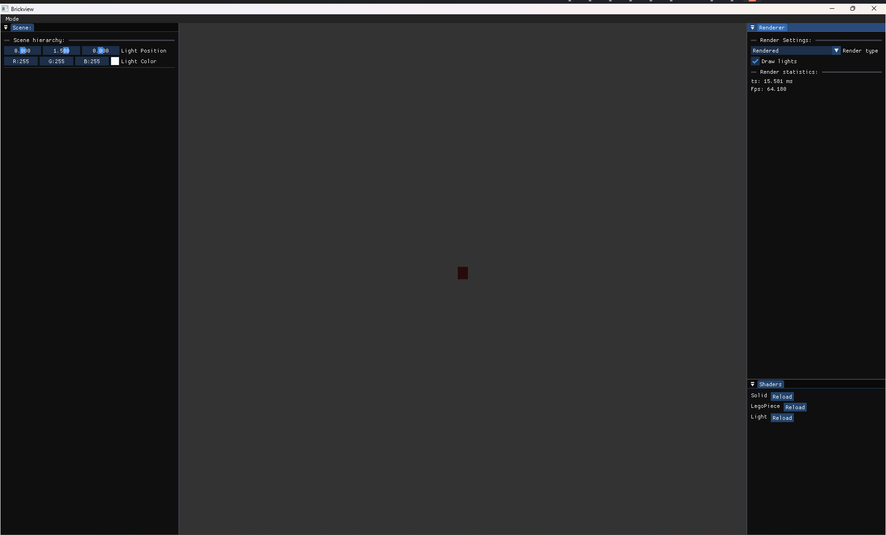

# Brickview



## Introduction

This program is a standalone application available on **Windows**. Lego parts can be viewed in a 3D space with the help of the **LDraw** resources.

## Build the project

The repository comes with submodules. Make sure to fetch all the dependencies with the following commands.

```bash
git submodule update --recursive --init
```

The application can be built using **CMake**. The project can be generated with the following commands.

```bash
mkdir build
cd build
cmake ..
cmake --build .
```

To run the application, the Lego parts data within a folder called `LDraw` are needed. Make sur to follow the instruction in the [resources section](#Resources)
Make sure to set the working directory to `BrickviewApp/`.

## Brickview application controls

The editor camera can be controlled with the mouse and the keyboard:

| Button                    | Description                                  |
|---------------------------|----------------------------------------------|
| Middle Mouse Button       | Camera rotation around the center (0, 0, 0)  |
| Mouse Scroll              | Zoom in/Zoom out                             |
| Maj + Middle Mouse Button | Camera translation                           |
| F key                     | Focus on selected object                     |

## Resources

As the data folder containing the Lego parts is big, it is not available on this repository.
The entire folder is available on the [LDraw](https://library.ldraw.org/updates?latest) website.

Make sure to copy and paste the LDraw folder in `BrickviewApp/data`.

## References

The architecture of the software as well as well as the code style is highly inspired from the youtube channel [The Cherno](https://www.youtube.com/@TheCherno). All of this is documented by the [Game Engine Series](https://youtube.com/playlist?list=PLlrATfBNZ98dC-V-N3m0Go4deliWHPFwT&si=-5jZiF8NPV4YkNbc).

## Next steps

Here is a list of the things to improve/add in the future:

- Serialize and deserialize scenes.
- Add an editor to assemble lego parts.
- Add lego part thumbnails.
