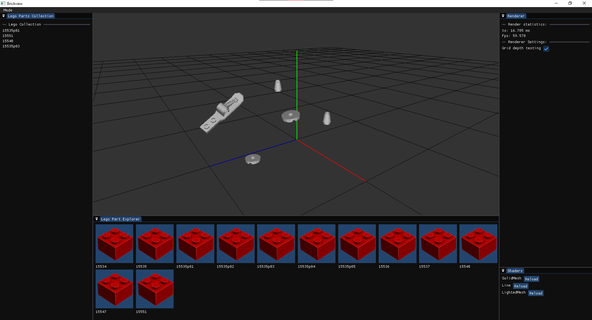

# Brickview



## Purpose

This program is a standalone application available on _Windows_. Lego parts can be viewed in a 3D space with the help of the _LDraw_ resources.

## How to run the app

Make sure to clone the repository using one of the following command:

``` bash
# SSH
git clone --recursive git@github.com:Malkrich/Brickview.git
# HTTPS
git clone --recursive https://github.com/Malkrich/Brickview.git
```

This project uses [_Premake_](https://premake.github.io/) as the build system, and can be compiled/run on [_Visual Studio Community_](https://visualstudio.microsoft.com/fr/downloads/). After cloning the project, the `GenerateProject.bat` file can be executed to generate the solution (`.sln`) file.

## Control

The editor camera can be controlled with the mouse and the keyboard:

| Button                    | Description                                               |
|---------------------------|-----------------------------------------------------------|
| Middle Mouse Button       | Camera rotation around the center (0, 0, 0)               |
| Mouse Scroll              | Zoom in/Zoom out                                          |
| Maj + Middle Mouse Button | Camera translation                                        |

## Resources

As the data folder containing the Lego parts is big, it is not available on this repository (work in progress...). An example of one lego part can be viewed on the screen for the moment.
The entire folder is available on the [LDraw](https://library.ldraw.org/updates?latest) website.

## References

The architecture of the software as well as well as the code style is highly inspired from the youtube channel [The Cherno](https://www.youtube.com/@TheCherno). The classes like Application, Layers, Event, or Input are explained in the [Game Engine Series](https://youtube.com/playlist?list=PLlrATfBNZ98dC-V-N3m0Go4deliWHPFwT&si=-5jZiF8NPV4YkNbc). However the Renderer class and the LDraw file loader are made from scratch.

## Next steps

Here is a list of the things to improve/add in the future:

- Refine instance rendering process, make 2 different render systems
- Make a __better renderer__, with multiple lights/HDRI.
- Add an __Entity Component System__ (ECS).
- Add an editor to __assemble lego parts__.
- __Serialize__ and __deserialize__ scenes.
- Software __documentation__.